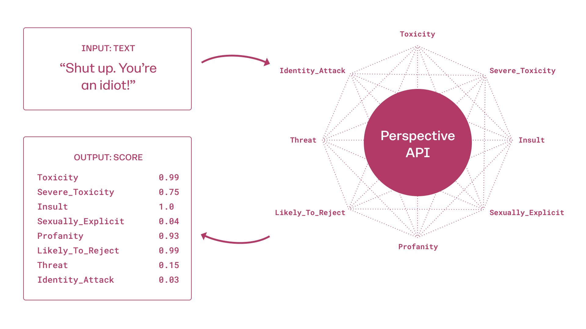

# 💬 Chat Monitoring

<figure><figcaption>
The PerspectiveAPI Work Cycle
</figcaption></figure>

### Overview

Perspective API uses machine learning models to score the perceived impact a comment might have on a conversation. The models evaluate comments across a range of emotional concepts, called attributes. For example, given a comment like “You are an idiot”, a model may “score” the comment as 0.8 for the TOXICITY attribute—indicating an 80% likelihood a reader would perceive the comment as toxic.

### Input and output

Input: Text

Output: A probability score between 0 and 1. A higher score indicates a greater likelihood a reader would perceive the comment as containing the given attribute.

### Attributes

Attributes describe emotional concepts that may impact a conversation. Perspective API’s primary attribute is TOXICITY, defined as “a rude, disrespectful, or unreasonable comment that is likely to make you leave a discussion”. Other attributes include SEVERE\_TOXICITY, IDENTITY\_ATTACK, INSULT, PROFANITY, THREAT, SEXUALLY\_EXPLICIT, and FLIRTATION. Note that not all attributes are available for all languages. You can find an up-to-date list of attributes and their definitions [here](https://support.perspectiveapi.com/s/about-the-api-attributes-and-languages).

### Training data

Perspective trains each model on millions of comments from a variety of sources, including comments from online forums such as Wikipedia (CC-BY-SA3 license) and The New York Times. For languages where less forum data is available, they use machine translation to translate labeled English-language comments into the target language.



### Labeling

Each comment is tagged by 3-10 crowdsourced raters from Figure Eight, [Appen](https://appen.com/) and internal platforms. The raters tag whether or not a comment contains an attribute (e.g. TOXICITY). We then post-process the tags to obtain labels corresponding to the ratio of raters who tagged a comment as toxic. For example, Perspective will label a comment as 0.6 for TOXICITY if 6 out of 10 raters tagged a comment as toxic.

### Architecture

Perspective starts by training multilingual BERT-based models on data from online forums. They then distill these models into single-language Convolutional Neural Networks (CNNs) for each language they support. Distillation ensures they can serve the models and produce scores within a reasonable amount of time.

### Uses & Limits

Perspective is intended to help moderators review comments, give real-time feedback to commenters, or allow readers to find interesting or productive comments. See Jigsaw’s [blog](https://medium.com/jigsaw) for case studies ranging from [commenting platforms](https://medium.com/jigsaw/helping-authors-understand-toxicity-one-comment-at-a-time-f8b43824cf41) to [gaming platforms](https://medium.com/jigsaw/one-of-europes-largest-gaming-platforms-is-tackling-toxicity-with-machine-learning-2c0affe4e059).

### Intended Uses

#### Human-assisted moderation

Make human moderation easier with a Perspective-backed tool to prioritize or sort comments. See this[ moderator tool](https://github.com/conversationai/conversationai-moderator) for an example.

#### Authorship feedback

Provide authors or commenters with real-time feedback when their comments might violate your community guidelines or might be perceived as “toxic” to the conversation. Perspective also offers feedback tools for when the API gets it wrong. See this [authorship demo ](https://github.com/conversationai/perspectiveapi-authorship-demo)for an example.&#x20;

#### Read better comments

Help readers explore the conversation and sort through comments on topics that can be difficult to discuss online. See this [viewership tool](https://github.com/conversationai/perspective-viewership-extension) for an example.

#### Contribute to research

Improve Perspective's collective understanding of toxicity online and help make conversations more equitable and productive for everyone online.

### Uses to Avoid

#### Fully automated moderation

Perspective is not intended for fully automated moderation. Machine learning models will always make some mistakes, so it’s essential to build in mechanisms for humans to catch and correct accordingly. Sentri includes filters and features to do just this, as it is an AUTOMATED moderator, not a SENTIENT moderator.

#### Character judgement

In order to maintain user privacy, the models operate only on individual comments. The models are not intended to detect anything about the individual who made the comment. In addition, Perspective does not collect or use prior information about an individual to inform predictions.

### Limitations & Tradeoffs

#### Scores indicate probability, not severity

The model output is a probability. As such, a comment with a TOXICITY score of 0.9 is not necessarily _more toxic_ than a comment with a TOXICITY score of 0.7. Rather, it’s _more likely to be perceived as toxic_ by readers.

#### Training models contain unintended social bias

Machine learning models learn from the data they’re trained with, so any biases in the data can creep into the predictions the models make. For example, Perspective's models sometimes predict higher toxicity scores for comments with terms for more frequently targeted groups (e.g. words like “black”, “muslim”, “feminist”, “woman”, or “gay”) because comments about those groups are over-represented in nominal samplings of abusive and toxic comments in the training data.&#x20;

